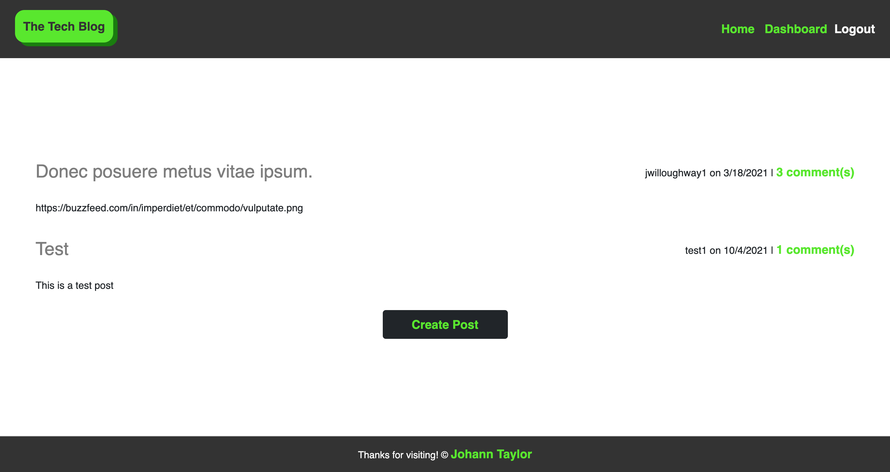

[](https://opensource.org/licenses/MIT)

  # Tech Blog

  ## Description

  A CMS style blog site with CRUD functionality. Users may also comment on the posts of other users.
  
  Link: https://johanntechblog.herokuapp.com/
  ## Table of Contents

  * [Technologies](#Technologies)
  * [Installation](#installation)
  * [Usage](#usage)
  * [License](#license)
  * [Contributing](#contributing)
  * [Test](#test)
  * [Questions](#questions)

  ### Technologies

  HTML5, JavaScript, CSS, Bootstrap, MySQL, Sequelize, Handlebars.js, Express.js, jest, Bcrypt

  ### Installation
  
  ```
  npm i
  ```

  ### Usage

  N/A

  ### License
  This project is licensed under [MIT](https://opensource.org/licenses/MIT)

  ### Contributing
  
  N/A

  ### Tests
  
  ```
  npm run test
  ```

  ## Questions
  
  If you have any questions about the repo, please contact me at j.taylor1343@gmail.com.

  You can find more of my work and projects at [johannt91](https://github.com/johannt91) or check out my personal [website](https://johanntaylor.com)!


